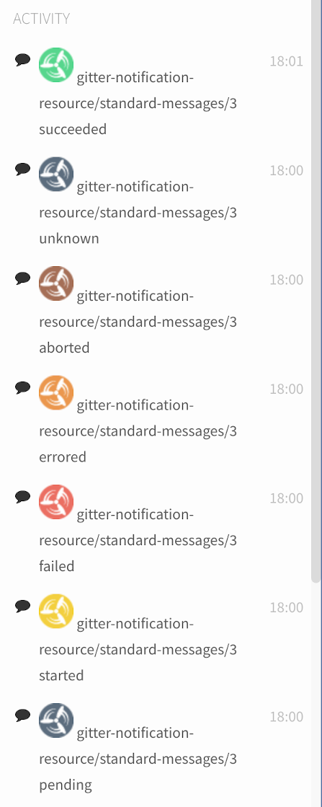

# [Gitter][] Notification Resource for [Concourse][]

[](https://gitter.im/flavorjones/webhook-notifications-resource?utm_source=badge&utm_medium=badge&utm_campaign=pr-badge&utm_content=badge)

Send markdown-formatted messages to a [Gitter][] channel from a [Concourse][] CI pipeline, including pre-formatted job status messages.



  [Gitter]: https://gitter.im
  [Concourse]: https://concourse.ci


## Background

[Gitter][] is a chat site based around source code repositories. It's free and I'm trying it for some of my open-source projects.

[Concourse][] is an open-source continuous thing-doer. It's pretty amazing for CI and for more complicated pipelines, you should check it out.

For more information on Concourse Resources:

- [Concourse Resource](https://concourse-ci.org/resources.html) - how to configure and use resources
- [Concourse Resource Types](https://concourse-ci.org/resource-types.html) - how resources work
- [Concourse Resource Directory](https://resource-types.concourse-ci.org/) - a collection of Concourse integrations


## Source Configuration

These parameters go into the `source` fields of the resource.

__Required__

* `webhook`: The target webhook URL provided by Gitter (see below for instructions on creating this webhook).

__Optional__

* `dryrun`: When set to `true`, the resource does not make any HTTP requests to Gitter. (Defaults to `false`)


## Invocation

### [`check`](https://concourse-ci.org/implementing-resource-types.html#resource-check) and [`in`](https://concourse-ci.org/implementing-resource-types.html#resource-in)

This resource only supports the `put` step, so these are no-ops in this resource.


### [`out`](https://concourse-ci.org/implementing-resource-types.html#resource-out)

[`put`](https://concourse-ci.org/jobs.html#schema.step.put-step.put) will connect to Gitter via webhook and send the configured markdown message.


#### Sending Pre-formatted Messages

This resource comes with some standard pre-formatted messages to reflect typical Concourse job status. You can easily send these messages by setting the following parameter:

* `status`: Set to one of the states named below to get a sane, well-formatted message.

Valid `status` values:

* `aborted` will post the contents of [resource/messages/aborted.md](resource/messages/aborted.md?raw=true)
* `errored` will post the contents of [resource/messages/errored.md](resource/messages/errored.md?raw=true)
* `failed` will post the contents of [resource/messages/failed.md](resource/messages/failed.md?raw=true)
* `pending` will post the contents of [resource/messages/pending.md](resource/messages/pending.md?raw=true)
* `started` will post the contents of [resource/messages/started.md](resource/messages/started.md?raw=true)
* `succeeded` will post the contents of [resource/messages/succeeded.md](resource/messages/succeeded.md?raw=true)

Any other value will post the contents of [resource/messages/unknown.md](resource/messages/unknown.md?raw=true).


#### Sending Custom Messages

To send a custom message, exactly one of the following parameters must be present:

* `message`: The markdown-formatted text of the notification to be sent.
* `message_file`: Path to a file containing the markdown-formatted text of the notification to be sent.

Any Concourse [metadata][] in the `message` string or in the text contents of `message_file` will be evaluated prior to sending the message. If the notification text contains newlines then it will be split into multiple IRC message sends.

> `${ATC_EXTERNAL_URL}/teams/${BUILD_TEAM_NAME}/pipelines/${BUILD_PIPELINE_NAME}/jobs/${BUILD_JOB_NAME}/builds/${BUILD_NAME}`

  [metadata]: http://concourse.ci/implementing-resources.html#resource-metadata


## Example usage

Here's how the standard messages might be configured in a Concourse pipeline file:

``` yml
resource_types:
- name: gitter-notification
  type: docker-image
  source:
    repository: flavorjones/gitter-notification-resource

resources:
- name: foobar-gitter-channel
  type: gitter-notification
  source:
    webhook: ((webhook_url))

jobs:
- name: run-some-tests
  plan:
    - task: run-a-test
      config: { ... }
  on_success: { put: foobar-gitter-channel, params: {status: "success"} }
  on_failure: { put: foobar-gitter-channel, params: {status: "failure"} }
  on_error:   { put: foobar-gitter-channel, params: {status: "error"} }
  on_abort:   { put: foobar-gitter-channel, params: {status: "abort"} }
```

And here's how you can configure a custom message:

``` yml
resource_types:
- name: gitter-notification
  type: docker-image
  source:
    repository: flavorjones/gitter-notification-resource

resources:
- name: foobar-gitter-channel
  type: gitter-notification
  source:
    webhook: ((webhook_url))

- name: post-a-message-to-gitter
  plan:
  - put: foobar-gitter-channel
    params:
      message: "_This_ is a *markdown* message about [${BUILD_PIPELINE_NAME}/${BUILD_JOB_NAME}/${BUILD_NAME}}](${BUILD_URL})"
```


## Configuration of a Gitter Webhook

See [docs/gitter-create-webhook.md](docs/gitter-create-webhook.md).


## Roadmap

The following features seem like reasonable things to implement, but I just haven't gotten around to them yet. If you'd like to help implement these, please do!

* Connecting to Gitter via HTTP proxy or tunnel


## Contributing

Pull requests are welcome, as are Github issues opened to discuss bugs or desired features.


### Development and Running the tests

#### Without a local Ruby environment

Requirements:

* make
* docker

To build an OCI image and run the tests in that image:

``` sh
$ make test
```

This iteration loop is slightly slower than working with a local Ruby environment (~3 seconds on my laptop).


#### With a local Ruby environment

Requirements:

* ruby >= 2.7

``` sh
$ bundle install && bundle exec rake test
```

This iteration loop is slightly faster than working inside a docker container (~1 second on my laptop).


## License

MIT. See the file named [`LICENSE`](LICENSE) in this repository.
