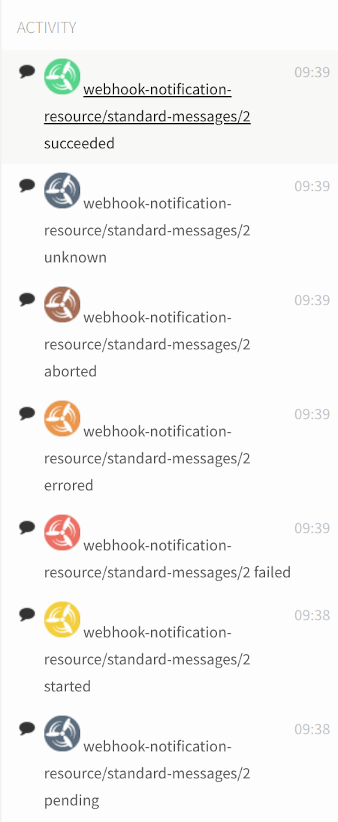

## Configuration of a Gitter Webhook

### Activity Feed

Here's what it looks like when this resource is posting to your channel's activity feed:

-

### Create a Gitter Webhook

Here's how to create a webhook for your Gitter channel.

1. Go to your channel settings:

2. Click on "Custom"

3. Copy your webhook URI

Your generated webhook should be kept private, probably in a concourse pipeline variables file.

